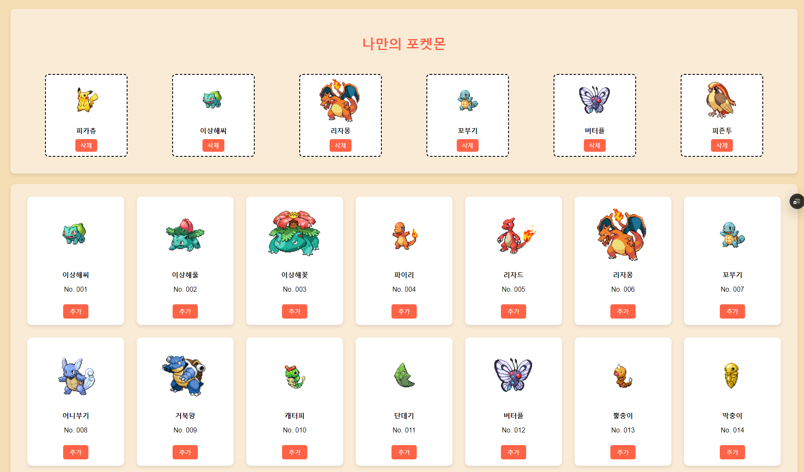
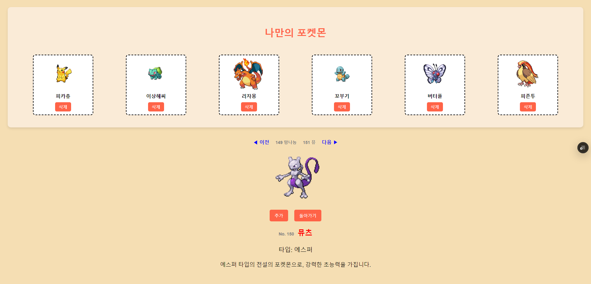

# **나만의 포켓몬**

**나만의 포켓몬들을 추가하고 삭제하면서 몬스터볼에 넣을 수 있는 웹 애플리케이션입니다.**

---

## 📸 **스크린샷**

### 포켓몬 목록



### 포켓몬 상세 정보



---

## ✨ **주요 기능**

- **포켓몬 추가** – 목록에 있는 포켓몬들을 몬스터볼에 추가할 수 있습니다.
- **추가된 포켓몬 삭제** – 몬스터볼에 추가된 포켓몬을 방생할 수 있습니다.
- **포켓몬 상세 정보 확인** – 포켓몬을 클릭하면 상세 정보 페이지로 이동합니다.
- **포켓몬 번호 이동** – 이전/다음 버튼을 사용하여 번호별 포켓몬을 탐색할 수 있습니다.

---

## 🛠 **기술 스택**

현재 배포된 사이트는 **Redux-Toolkit 기반**으로 동작하지만, 로컬에서는 `Prop-Drilling`과 `Context API`도 적용되어 있습니다.

| 기술 스택             | 설명                                       |
| --------------------- | ------------------------------------------ |
| **React**             | UI 구축 및 상태 관리                       |
| **Vite**              | 빠른 개발 환경 설정                        |
| **Styled-components** | 스타일링 및 반응형 레이아웃 적용           |
| **Redux-Toolkit**     | 글로벌 상태 관리 (현재 배포된 사이트 기준) |
| **Vercel**            | 프론트엔드 배포                            |
| **ESLint**            | 코드 품질 유지 및 검사                     |
| **Prettier**          | 코드 포맷팅 자동화                         |

---

## 🚀 **실행 방법**

### 🖥️ **배포된 사이트**

[Pokemon Pokedex (Vercel 배포)](https://pokemon-pokedex-git-redux-toolkits-sharetws-projects.vercel.app/)

### 🛠 **로컬 실행 방법**

```bash
# 1. 프로젝트 클론
git clone https://github.com/사용자명/포켓몬-프로젝트.git
cd 포켓몬-프로젝트

# 2. 패키지 설치
npm install   # 또는 yarn install

# 3. 개발 서버 실행
npm run dev   # 또는 yarn dev
```

---

## 📂 **프로젝트 폴더 구조 (Redux-Toolkit 기준)**

```plaintext
Pokemon-Pokedex
├─ eslint.config.js
├─ index.html
├─ package.json
├─ public
│  ├─ images
│  │  ├─ dex.png
│  │  ├─ pokemon_detail.png
│  │  └─ pokemon_logo.svg
│  └─ vite.svg
├─ README.md
├─ src
│  ├─ App.css
│  ├─ App.jsx
│  ├─ assets
│  │  └─ react.svg
│  ├─ components
│  │  ├─ Dashboard.jsx
│  │  ├─ PokemonCard.jsx
│  │  ├─ PokemonDetail.jsx
│  │  └─ PokemonList.jsx
│  ├─ index.css
│  ├─ main.jsx
│  ├─ pages
│  │  ├─ Dex.jsx
│  │  ├─ Home.jsx
│  │  └─ MOCK_DATA.jsx
│  └─ redux
│     ├─ pokemonSlice.js
│     └─ store.js
├─ vite.config.js
└─ yarn.lock
```

---

## 🕹️ **사용 방법**

### 1️⃣ 포켓몬 추가

- 포켓몬 카드의 **"추가"** 버튼을 누르면, 상단 몬스터볼 영역에 추가됩니다.

### 2️⃣ 포켓몬 삭제

- 추가된 포켓몬 카드에서 **"삭제"** 버튼을 누르면 몬스터볼에서 사라집니다.

### 3️⃣ 포켓몬 상세 정보 보기

- 포켓몬 카드를 클릭하면 상세 정보 페이지로 이동합니다.

### 4️⃣ 이전/다음 포켓몬 탐색

- 상세 페이지에서 **"이전" / "다음"** 버튼을 눌러 다른 포켓몬으로 이동할 수 있습니다.
